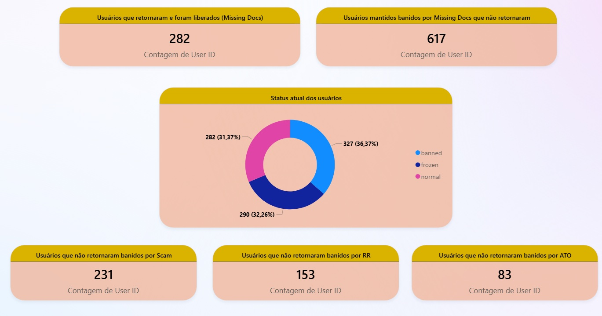

# 👋🏻 Hi, I'm Álvaro

## About Me  

🚀 Professional with over 6 years of experience, specializing in translating complex analyses into process optimization and systemic impact.  

🔧 Skilled in **SQL, Python, and Power BI**, I move beyond standard analysis to build data pipelines, automate tasks, and identify the root causes of operational issues. 

🤖 I also have experience with Machine Learning Development, where I collaborated on building a Generative AI bot to adjudicate fraud cases in bulk, based on rules and conditions from its internal Standard Operating Procedure (SOP).

🎓 Currently, I'm studying **Analysis and Systems Development with a focus on Data Engineering** at Cruzeiro do Sul University to expand my technical knowledge.  

---

## Skills & Technologies  

- **Programming Languages**: SQL, Python, JavaScript
- **Version Control & Tools**: Git, GitHub  
- **Databases**: MySQL, TiDB
- **Analysis & Visualization**: Power BI, Looker Studio 
- **Machine Learning & Automation**: Contributed to the training of Machine Learning models, focusing on the reduction of false positives. 

---

## Professional Highlights  

- 📊 **Process Optimization & BI Reporting**: Developed and implemented a Power BI study focused on optimizing the document analysis process. The project was approved by the process team and resulted in a reduction of over 60% in pending documentation, significantly impacting the area's KPIs.
- 🤖 **Generative AI & Machine Learning**: Contributed to the development of a Generative AI bot for mass ticket closure. I assisted the Data Engineering team with the bot's Machine Learning by defining conditions and developing prompts to handle a specific tag with a high false-positive rate, thereby improving operational efficiency.
- 🛡️ **Data Quality and Diagnostics**: Promptly identified inconsistencies and bugs during high-demand events, documenting evidence and proposing technical solutions via Jira Tickets to ensure data reliability.

### 📊 Featured Project: Fraud Analysis Dashboard

As part of my focus on process optimization and risk reduction, I developed this Power BI dashboard to monitor fraud volume and document SLA. 

*(Note: Sensitive data and absolute numbers have been masked to protect business compliance and confidentiality).*

<b>🖼️ Clique aqui para ver as telas do Dashboard</b>

 

**1. KPI Overview & Fraud Tags**

**2. Status Analysis & Distribution**

---

## Fun Facts  

- 📚 I'm a literature enthusiast, always looking to learn from the classics and philosophy.  
- 🧑🏻‍💻 I'm a lifelong learner, dedicating my free time to diving deeper into data engineering and advanced analytics.  

---

## Contact  

📧 Reach me at: alvarogomesbarboza@gmail.com  
🔗 LinkedIn: [Álvaro Barboza](https://www.linkedin.com/in/%C3%A1lvaro-barboza-287326183/)

